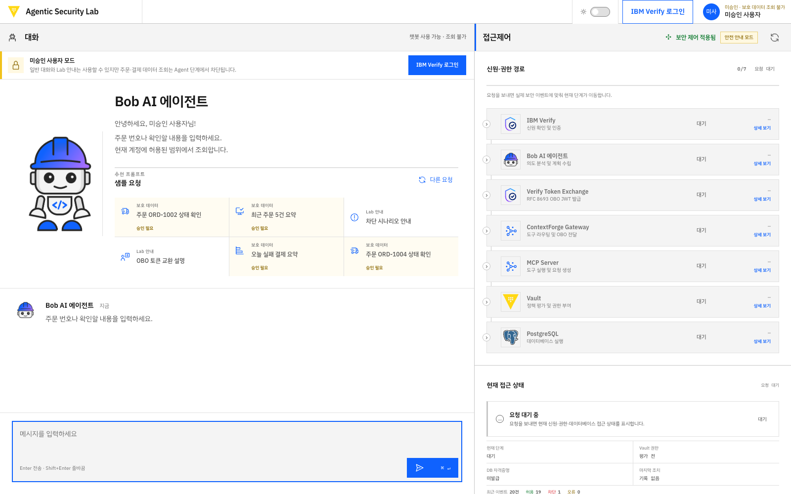
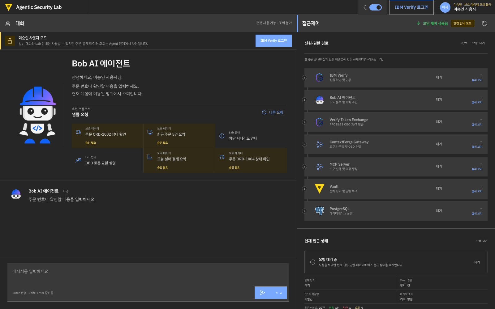
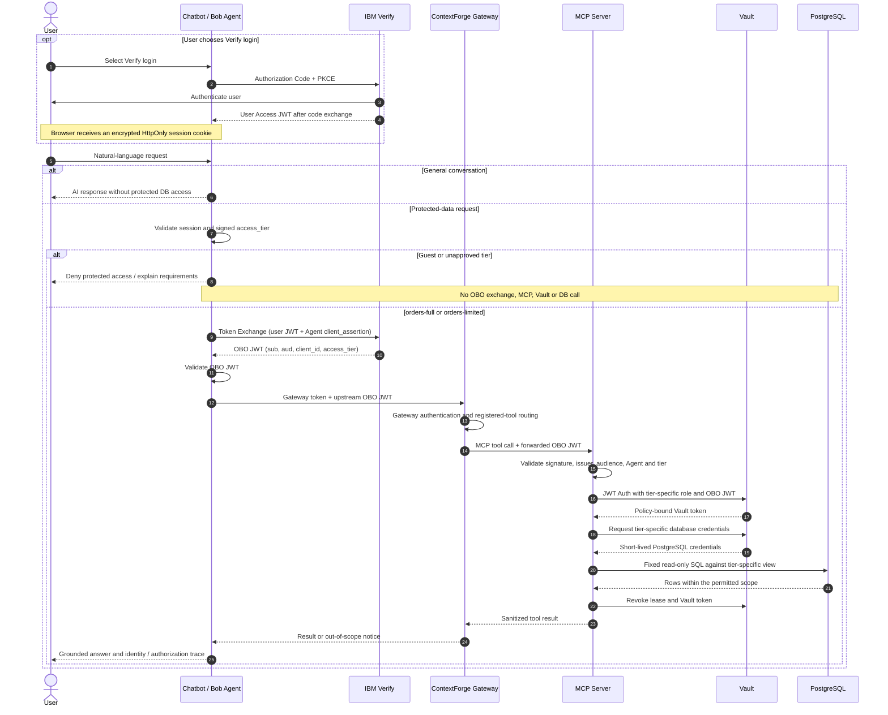

# Vault Agentic AI Demo

[한국어](README.md) · [English](README.en.md)

**IBM Verify handles authentication and delegation. Vault controls credentials and data access.**

## Purpose

This demo shows an AI Agent querying protected order data on behalf of a user through IBM Verify, ContextForge MCP Gateway, HashiCorp Vault Enterprise and Amazon RDS for PostgreSQL.

The custom UI uses Carbon design elements; it is not an official IBM product interface.

## Benefits

- Distinguish user authentication, Agent identity, delegation, and data authorization within one request.
- Compare full, limited, and unapproved users to see where access restrictions apply.
- Learn short-lived credential access without passing database passwords to the model.

## Chatbot UI

General conversation is available before login. Protected data requires Verify authentication and an approved access tier.



<details>
<summary>Dark mode</summary>



</details>

These are actual deployed UI screenshots in **unapproved-user mode**, with Korean interface text. They are not evidence of successful full/limited-user authentication.

Features include natural-language conversation, shuffled examples, read-only MCP tools, a seven-stage identity trace, detailed step dialogs, operator links and light/dark themes.

## Scenarios

| Identity                           | General chat | Visible orders            | Out-of-scope request              |
| ---------------------------------- | ------------ | ------------------------- | --------------------------------- |
| Full approval: `orders-full`       | Allowed      | ORD-1001 through ORD-1004 | Only registered tools and views   |
| Limited approval: `orders-limited` | Allowed      | ORD-1001, ORD-1004        | “Not found or unauthorized”       |
| Guest or unapproved tier           | Allowed      | None                      | Blocked before the protected path |

All order data is synthetic. The limited tier is scoped to sample customer `CUS-1001`. Authorization uses the signed `access_tier` claim, not hardcoded personal usernames.

## Sequence diagram



**Implementation detail:** Gateway authentication and Verify OBO authentication are separate. The Agent sends the Gateway token in `Authorization` and the OBO JWT in `X-Upstream-Authorization`. ContextForge routes registered tools; MCP Server validates Verify OBO claims. The Gateway is not the independent authority for the user's data tier.

The demo uses Vault **JWT Auth, policies and the Database secrets engine**. It does not implement the separate Vault Agent Registry / native agentic IAM flow. See [architecture](docs/ARCHITECTURE.md).

## Install and run

You need an AWS account, existing VPC/subnets/DNS, IBM Verify configuration and a valid Vault Enterprise license. EC2, ECS, RDS, ALB and related services incur costs. Do not apply this template blindly to a production environment.

1. Complete the prerequisites and private inputs in the [English installation guide](docs/SETUP.en.md).
2. Provision the AWS build plane and base infrastructure.
3. Configure the Verify OIDC app, Agent STS client and signed access-tier mappings.
4. Initialize Vault/DB and deploy the chatbot.
5. Test actual full and limited user logins independently.

Local source validation does not deploy AWS resources:

```bash
git clone https://github.com/Byeongwook-Heo/vault-agentic-ai-demo.git
cd vault-agentic-ai-demo
npm ci
npm run typecheck
npm test
npm run build
npm run check:publication
```

Use the Node/npm versions in [package.json](package.json). `make ci` runs AWS CodeBuild, not local tests.

## Documentation

- [Installation: Korean](docs/SETUP.ko.md) / [English](docs/SETUP.en.md)
- [Verify login and OBO configuration](docs/CHATBOT_VERIFY_SETUP.md)
- [Access-tier enforcement](docs/ACCESS_TIER_SETUP.md)
- [Demo walkthrough](docs/DEMO_SCRIPT.md)
- [Operations and verification](docs/OPERATIONS_RUNBOOK.md)
- [Troubleshooting](docs/TROUBLESHOOTING.md)
- [Publication hygiene](docs/PUBLISHING.md) / [Third-party notices](THIRD_PARTY_NOTICES.md)

Most detailed walkthroughs are in Korean; the English installation guide is self-contained.

## Verification scope

The repository includes unit/regression tests and unauthenticated endpoint checks. The access report verifies Vault/DB role isolation; it **does not perform two real users' Verify logins**. Each new deployment needs those final interactive checks. This is a single-Vault-node demo, not a production HA reference or a guarantee against every failure mode.

Never commit operational credentials, tokens, private keys, licenses, Terraform state/plans, logs or browser sessions.
