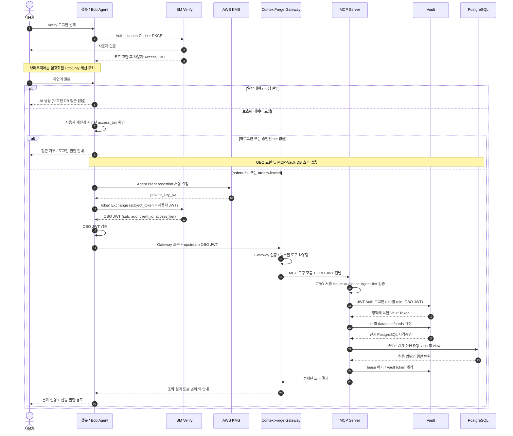

# Vault Agentic AI Demo

[한국어](README.md) · [English](README.en.md)

**사용자 인증은 IBM Verify, Agent 신원은 KMS 서명, 비밀정보와 DB 권한은 Vault.**

AI Agent가 사용자를 대신해 주문 데이터를 조회할 때, 누가 요청했는지와 어떤 범위까지 허용되는지를 보여주는 데모입니다. IBM Verify, ContextForge MCP Gateway, HashiCorp Vault Enterprise, Amazon RDS for PostgreSQL을 연결합니다.

이 저장소는 별도 관리용으로 분리한 배포 템플릿입니다. 실제 계정·테넌트·접속 주소·사용자 이름·개인 경로·자격증명은 포함하지 않습니다. 화면은 Carbon 디자인 요소를 활용한 커스텀 UI이며, 공식 IBM 제품 UI 자체는 아닙니다.

## 챗봇 UI

로그인 전에도 일반 대화와 구성 설명을 이용할 수 있습니다. 보호된 데이터 조회에는 Verify 인증과 승인된 권한이 필요합니다.


<details>
<summary>다크 모드 보기</summary>


</details>

실제 배포 화면의 **미승인 사용자 모드** 캡처입니다. 전체·제한 사용자의 실제 로그인 성공 증빙을 뜻하지 않습니다.

- 자연어 대화, 셔플되는 샘플 요청, 읽기 전용 도구 호출
- Verify → Agent → OBO 교환 → Gateway → MCP → Vault → DB 단계 표시
- 단계별 설명·예시 코드 팝업과 운영 UI 링크
- 라이트/다크 전환, 접근 거부 이유와 조회 가능한 범위 표시

## 데모 시나리오

| 사용자 상태                | 일반 대화 | 조회 가능한 주문    | 범위 밖 요청                             |
| -------------------------- | --------- | ------------------- | ---------------------------------------- |
| 전체 승인 `orders-full`    | 가능      | ORD-1001 ~ ORD-1004 | 등록된 도구·뷰 범위만 허용               |
| 제한 승인 `orders-limited` | 가능      | ORD-1001, ORD-1004  | “조회 권한이 없거나 주문을 찾을 수 없음” |
| 미로그인 또는 권한 미승인  | 가능      | 없음                | Agent에서 차단, 보호된 경로 미호출       |

데이터는 합성 샘플입니다. 제한 사용자는 예제 고객 `CUS-1001` 범위만 읽습니다. 실제 계정 이름이 아니라 Verify가 서명한 `access_tier`로 권한을 판단합니다.

## 작동 플로우 · 시퀀스 다이어그램



**구현상 중요한 구분:** Gateway의 자체 인증 토큰과 Verify OBO JWT는 서로 다릅니다. Agent는 Gateway 토큰을 `Authorization`에, OBO JWT를 `X-Upstream-Authorization`에 전달합니다. Gateway는 등록된 도구를 중계하고 MCP Server가 Verify OBO를 검증합니다. Gateway가 Verify 사용자 권한을 독자적으로 결정한다고 설명하면 정확하지 않습니다.

이 데모는 Vault **JWT Auth + 정책 + Database secrets engine**을 사용합니다. Vault의 별도 Agent Registry / native agentic IAM 기능을 구현한 예제는 아닙니다. [구조와 경계](docs/ARCHITECTURE.md)

## 설치 및 실행

AWS 계정, 기존 VPC·서브넷·DNS, IBM Verify 설정, 유효한 Vault Enterprise 라이선스가 필요합니다. 생성되는 EC2·ECS·RDS·ALB 등에 비용이 발생합니다. 기존 운영 환경에 그대로 적용하지 마세요.

1. [한국어 설치 가이드](docs/SETUP.ko.md)의 사전 준비와 환경 입력값을 작성합니다.
2. AWS 빌드 기반과 기본 리소스를 생성합니다.
3. Verify 사용자 앱과 Agent STS 클라이언트, `access_tier` 매핑을 설정합니다.
4. Vault·DB를 초기화하고 챗봇을 배포합니다.
5. 전체/제한 사용자로 각각 로그인하여 확인합니다.

소스 코드 검증은 AWS 배포 없이 실행할 수 있습니다.

```bash
git clone https://github.com/Byeongwook-Heo/vault-agentic-ai-demo.git
cd vault-agentic-ai-demo
npm ci
npm run typecheck
npm test
npm run build
npm run check:publication
```

Node/npm 버전은 [package.json](package.json)을 따릅니다. `make ci`는 로컬 테스트가 아니라 CodeBuild 작업입니다.

## 문서

- [설치 (한국어)](docs/SETUP.ko.md) / [Installation (English)](docs/SETUP.en.md)
- [Verify 로그인·OBO 설정](docs/CHATBOT_VERIFY_SETUP.md)
- [권한을 부여하고 차단하는 위치](docs/ACCESS_TIER_SETUP.md)
- [발표용 데모 진행 순서](docs/DEMO_SCRIPT.md)
- [운영·검증·접속](docs/OPERATIONS_RUNBOOK.md)
- [문제 해결](docs/TROUBLESHOOTING.md)
- [공유 전 점검과 제3자 자산](docs/PUBLISHING.md) / [Notices](THIRD_PARTY_NOTICES.md)

## 검증 범위와 제한

단위·회귀 테스트와 비인증 엔드포인트 검사를 제공합니다. 권한 비교 스크립트는 Vault/DB 역할의 차이를 검증하며 **두 사용자의 Verify 로그인을 대신하지 않습니다**. 새 환경에서는 실제 전체/제한 계정으로 최종 로그인 검증이 필요합니다. 단일 Vault 노드 기반 데모이며 프로덕션 HA 구성이나 모든 장애 조건을 보증하는 예제가 아닙니다.

개인 운영 파일, 토큰, AWS 키, SSH 키, Vault 라이선스, Terraform state/plan, 로그와 브라우저 세션은 Git에 올리지 않습니다.
