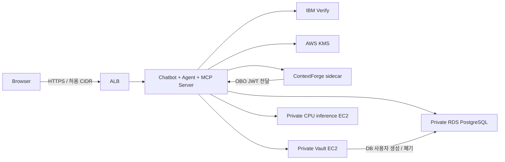

# 구조와 신뢰 경계 / Architecture

현재 구현의 정확한 시퀀스는 [한국어 README](../README.md)와 [English README](../README.en.md)에 있습니다.

## 논리 구성과 실제 배치

챗봇, Agent, MCP Server는 같은 애플리케이션 프로세스의 논리 역할입니다. Gateway는 같은 ECS Task의 별도 컨테이너이며 loopback 통신을 사용합니다. Vault와 추론 런타임은 별도 private EC2, DB는 private RDS입니다.

- Verify: 사용자 인증, 사용자 JWT 및 OBO JWT 발급. 사용자 권한은 서명된 claim으로 전달합니다.
- Agent: 세션/tier 확인, 요청 계획, KMS 기반 client assertion, OBO 교환·검증, 등록된 도구 호출 및 결과 설명.
- Gateway: 자체 토큰 검증, virtual server/tool 등록·검색·라우팅, upstream OBO 전달. 관리 UI는 인터넷에 공개하지 않습니다.
- MCP: OBO JWT의 서명/issuer/audience/actor/tier와 도구 인자를 검증합니다.
- Vault: OBO JWT로 role에 로그인, bound claims와 정책 적용, tier별 단기 DB 자격증명 발급.
- PostgreSQL: role별 SELECT 권한과 제한 view로 행 범위를 제한합니다.
- 추론 런타임: 자연어 계획·응답을 처리합니다. 사용자 입력과 제한된 대화 맥락, 정제된 조회 결과를 받을 수 있으나 JWT·Vault token·DB 비밀번호를 받지 않습니다.

## 토큰과 자격증명

사용자 Access Token은 서버가 암호화한 HttpOnly/Secure 세션 쿠키에 포함됩니다. 브라우저 JavaScript에 평문 JWT를 제공하지 않습니다. “사용자 토큰이 오직 서버 메모리에만 있다”는 설명은 이 구현에 맞지 않습니다.

KMS의 개인키는 추출하지 않고 서명 API를 사용합니다. OBO JWT는 사용자 `sub`, 요청 대상 `aud`, Agent의 `client_id`, `access_tier`를 연결합니다. OBO 토큰을 MCP와 Vault에서 검증하며 별도의 두 번째 “Vault용 토큰 교환”은 수행하지 않습니다.

Vault DB credential은 기본 TTL 2분, 최대 5분입니다. 요청 정리 과정에서 lease와 Vault token 폐기를 시도하며, 오류 시 TTL이 추가 만료 경계가 됩니다. 모델에는 자격증명 대신 정제된 도구 결과만 전달됩니다.

## 구현 범위

본 저장소는 전통적인 Vault JWT Auth + Database secrets engine 경로입니다. [Vault agentic IAM](https://developer.hashicorp.com/vault/ai/iam)의 Agent Registry/ceiling policy 실험은 포함하지 않습니다.

단일 Vault 노드, 데모용 합성 데이터, 넓은 권한의 설치용 CodeBuild role을 사용합니다. 설치 role과 runtime role은 구분되며 조직 환경 도입 전 별도 IAM·라이선스·가용성 검토가 필요합니다.
